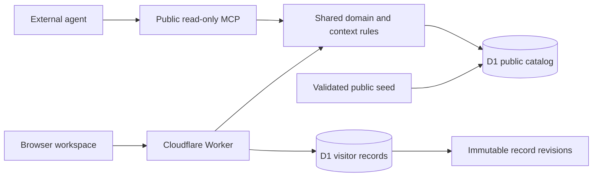

# Architecture

## Boundaries

The static workspace is bundled with esbuild and served through the Worker. Source assets and fonts are local; the browser does not need a third-party font or logo service. The Worker supplies security headers and explicitly routes JSON APIs and MCP before assets.

The public catalog is a curated source fixture imported into D1 after schema and reference validation. It contains public facts, attributed company claims, and clearly identified analytical hypotheses. A catalog version links retrieval output to its source snapshot. Fixture history lives in Git; private visitor data never enters the repository.

Each visitor receives a cryptographically random token in an HttpOnly cookie. D1 stores its SHA-256 hash, expiration and CSRF token. Queries derive the owner from the validated session, never the request body. All writes require an exact Origin match and session-bound CSRF token. No CORS access to private APIs is granted.

Versioned updates commit with `WHERE owner_id=? AND id=? AND version=?`; conflicts return 409. Database triggers append revisions atomically. Archive is recoverable; history cannot be edited through the API. Quotas bound record counts, request size and revision growth for a public demo.

## Agent context

`packages/core/context.js` provides one deterministic retrieval function for HTTP and MCP. It selects company records, observations, thesis summaries and research briefs, then collects the cited source metadata. Context is bounded by serialized character length; the displayed token count is an estimate, not a tokenizer guarantee.

There are no separate model memories, vector databases, or agent-specific copies of company facts. Source material never changes tool permissions. Public tools cannot see visitor data. See [context contract](context-contract.md).

## Deliberate MVP tradeoffs

- Public read access removes first-visit setup. Private collaboration needs a future organization identity layer, roles and deal-level permissions.
- Manual source curation makes the initial analysis auditable. Automated adapters must maintain provenance, deduplication and review before replacing this workflow.
- Lexical retrieval is sufficient to demonstrate a small catalog. Vector ranking should be added only with a larger corpus and measured retrieval benefit.
- Private fund reporting remains unconnected. `marketMetrics` in the validated D1 catalog stores disclosed funding rounds with source references and company IDs. The market overview selects research candidates only, and related observations are available to the shared context tools.
- Visitors can evaluate real persistence without accounts, but cookie access is temporary and cannot be recovered. Export and clear disclosure are part of the interface.

## Extension points

Authenticated teams can use the same domain rules with an organization/member model. An ingestion workflow can persist source revisions and hashes, invalidate dependent briefs, and propose reviewed changes. Model-driven research should add versioned prompts, tool allowlists, budgets, replayable run records and citation-support evaluations before it is called autonomous.
